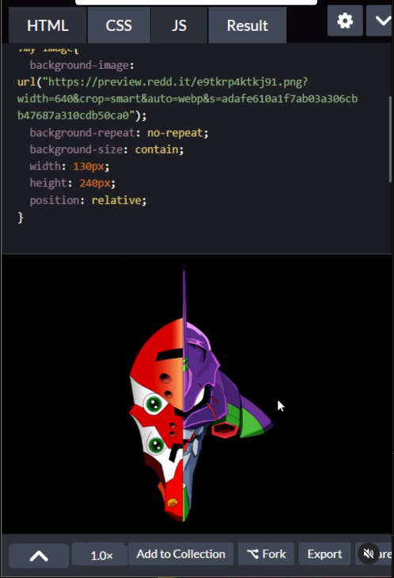

- Primero necesitamos un div con un background con las siguientes props:

```html
<div id='idBackground'></div>
```

```css
#idBackground{
    background-image:url('url');
    background-repeat: no-repeat;
    background-size: contain;
    width: 200px;
    height: 200px;
    position: relative;
}
```

Vamos a utilizar la pseudo clase `after` para crear el efecto:

```css
#idBackground::after{
    content:"";
    width: 100%;
    height: 100%;
    background: inherit;
    position: absolute;
    filter: drop-shadow(0px 0px) blur(20px);
    z-index: -1;
}
```